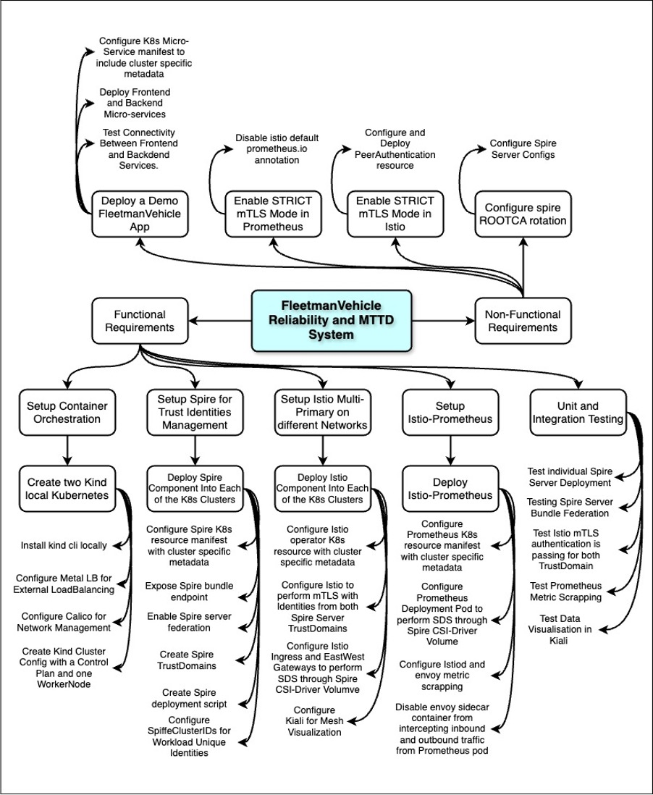
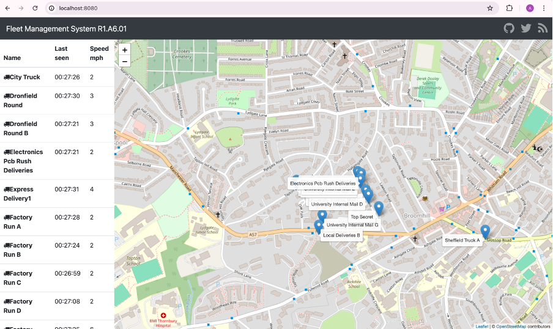
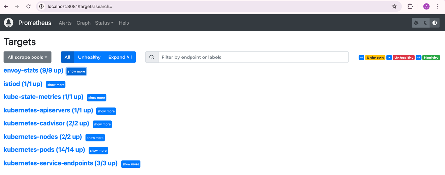
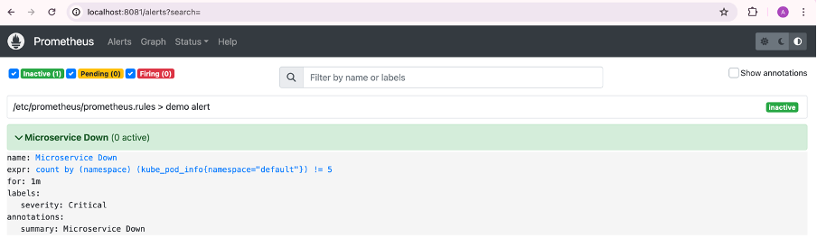
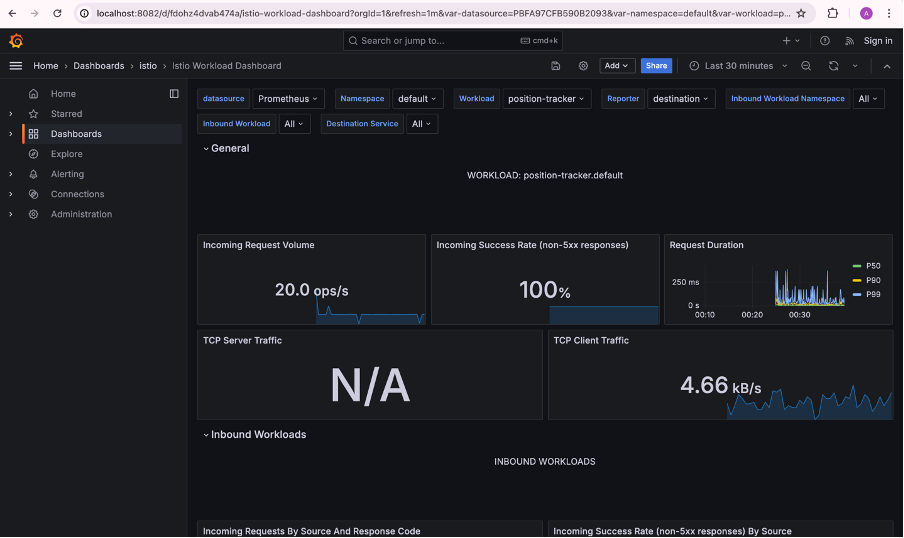
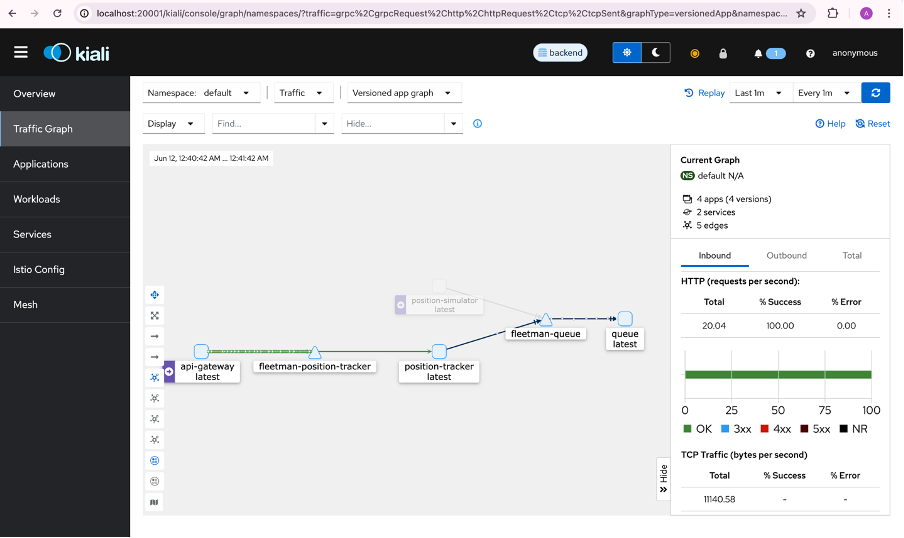

# DOCUMENTATION FOR FLEETMAN VEHICLE FLEET MANAGEMENT MTTD REDUCTION PROJECT

FleetmanVehicle is a vehicle fleet management company which provides important information to its clients concerning the state of their fleet. This information consists of the routes taken by vehicles, vehicle positions, and better route management to avoid delays. The vehicles are supposed to have a physical device attached to them which transmit data to the base station for processing and subsequent feedback to its different clients. This physical device was replaced by the position-simulator micro-service. The base station contains a queuing system (ActiveMQ), API gateway, and position tracker micro-services. The client had access to a front-end, the webapp, where their fleet are visualized.

## Table of Content

- [DOCUMENTATION FOR FLEETMAN VEHICLE FLEET MANAGEMENT MTTD REDUCTION PROJECT](#documentation-for-fleetman-vehicle-fleet-management-mttd-reduction-project)
- [Table of Content](#table-of-content)
- [Introduction](#introduction)
- [Architectural Diagram](#architectural-diagram)
- [Deployment Information](#deployment-information)
    - [Steps to Install/Deploy](#steps-to-installdeploy)
- [Hardware/Software Requirements](#hardwaresoftware-requirements)
- [Visualizing Results](#visualizing-results)

## Introduction

The project focuses on reducing the Mean Time to Detection (MTTD) for issues in Fleetman’s vehicle fleet management system. This involves deploying a microservice application on a Kubernetes cluster and integrating various tools for enhanced security, monitoring, and alerting.

## Architectural Diagram

The first part to the implementation of this project started with a mind mapping of the various aspect the project consists of. This provided the basic framework on which the main implementation was based off on. The diagram depicting this mind mapping is shown in the figure below.

Subsequently, after the implementation, the architectural diagram for the fully implemented solution was developed. The diagram depicting this is shown below.

## Deployment Information

The pre-requisite to running this project is that you should have docker desktop installed and kind cli also installed locally. These instructions relates to how you can run this solution locally using the GitHub repository. Also, you would need to install istioctl and kubectl to manage Istio service mesh and the Kubernetes cluster respectively. You have to configure slack to get an incoming webhook which you will need to integrate into the Prometheus configmap manifest.

### Steps to Install/Deploy

1.	Kubernetes Cluster Setup: Change directory (cd) into the kind directory and execute the bash script setup.sh by running the command ./setup.sh. This is a bash script which automates the installation of the kind Kubernetes clusters. This script will create two identical Kubernetes clusters with Cilium, a Container Networking Interface (CNI) and metallb, a component which provides load balancing services with external IPs. Confirm that all pods are running on the kube-system namespace.
2.	Install SPIRE: Change directory (cd) into the spire directory. If you are still within the kind directory, run the command cd ../spire. If you are in the root directory, run cd spire. Run the bash script bring-up-spire.sh by running the command ./bring-up-spire.sh. Confirm that all pods are running on the spire namespace.
3.	Install Istio: Change directory (cd) into the istio directory. If you are still within the spire directory, run the command cd ../istio. If you are in the root directory, run cd istio. Run the bash script installistio.sh by running the command ./installistio.sh. Confirm that all pods are running on the istio-system namespace.
4.	Deploy Fleetman Microservice: Change directory (cd) into the fleetman-app directory. If you are still within the istio directory, run the command cd ../istio. If you are in the root directory, run cd istio. Run the bash script install-app.sh by running the command ./install-app.sh. Confirm that all pods are running on the default namespace.
5.	Deploy Prometheus: Change directory (cd) into the prometheus directory. If you are still within the fleetman-app directory, run the command cd ../prometheus. If you are in the root directory, run cd prometheus. Run the bash script setup.sh by running the command ./setup.sh. This script will also install Alertmanager. Confirm that all pods are running on the monitoring namespace.
6.	Install Grafana: Change directory (cd) into the grafana directory. If you are still within the prometheus directory, run the command cd ../grafana. If you are in the root directory, run cd grafana. Run the bash script install.sh by running the command ./install.sh. Confirm that all pods are running on the istio-system namespace.
7.	Deploy Kiali: Change directory (cd) into the kiali directory. If you are still within the grafana directory, run the command cd ../kiali. If you are in the root directory, run cd kiali. Run the bash script kiali.sh by running the command ./kiali.sh. Confirm that all pods are running on the istio-system namespace.

## Hardware/Software Requirements

- Hardware: Sufficient CPU, memory, and storage resources based on the scale of deployment.
- Software:
- Kubernetes (v1.18+)
- SPIRE (latest stable version)
- Istio (v1.9+)
- Prometheus (v2.26+)
- Alertmanager (v0.22+)
- Kiali (v1.34+)
- Grafana (v7.5+)

## Visualizing Results

To visualize the results after completing the implementation steps above, follow the below steps: 
- First run the command to switch to the right cluster
- kubectl config use-context kind-backend
- Fleetman Webapp: Run the below commands
    - kubectl config set-context --current --namespace default
    - kubectl get pods. Note the pod name which has the webapp.
    - kubectl port-forward \<webapp-pod-name> 8080:80
    - Open your browser and type localhost:8080

- Prometheus: Run the below commands
    - kubectl config set-context --current --namespace monitoring
    - kubectl get pods. Note the pod name which has the prometheus.
    - kubectl port-forward \<prometheus-pod-name> 8081:9090
    - Open your browser and type localhost:8081

- Grafana: Run the below commands
    - kubectl config set-context --current --namespace istio-system
    - kubectl get pods. Note the pod name which has the grafana.
    - kubectl port-forward \<grafana-pod-name> 8082:3000
    - Open your browser and type localhost:8082

- Kiali: Run the below commands
    - kubectl config set-context --current --namespace monitoring
    - istioctl dashboard kiali. This will automatically open kiali dashboard on the browser.

